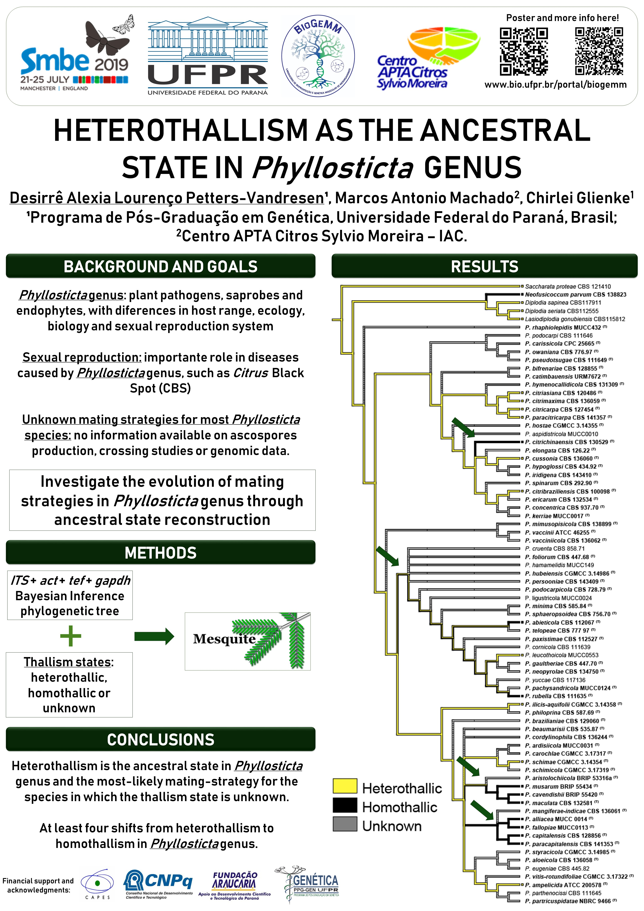

**Desirrê AL Petters-Vandresen**, Marcos A Machado, Chirlei Glienke

Genetics, Federal University of Paraná, Curitiba

Centro de Citricultura Sylvio Moreira, Cordeirópolis, Brazil

*Phyllosticta* genus comprises many plant pathogens, endophytes and saprophytes, and they differ in their biology and ecology by many aspects, such as the system of sexual reproduction, which plays an important role in the plant diseases caused by this genus. Some species, such as *P. capitalensis*, *P. abieticola* and *P. musarum*, are known to be homothallic due to the ascospores production in pure cultures. Other species, such as *P. citricarpa* and *P. citribraziliensis*, were suggested as heterothallic based in genomic analysis of the mating-type locus. However, for most of the *Phyllosticta* species, the mating strategies are unknown, as there is no information available on ascospores production, crossing studies or genomic data. In order to investigate the evolution of mating strategies in *Phyllosticta* genus, we performed an ancestral character reconstruction analysis in Mesquite using a multilocus phylogenetic tree (ITS, tef1, act, gapdh) of *Phyllosticta* and Botryosphaeriaceae species to map the characters. Species were defined as heterothallic, homothallic or unknown based in genomic data and taxonomic characterizations available in the literature. Our results suggest that heterothallism is the ancestral state in *Phyllosticta* genus and the most-likely mating-strategy for the *Phyllosticta* species in which the thallism state is unknown. In addition, there were at least four shifts from heterothallism to homothallism in *Phyllosticta* genus. These results contribute to the understanding of the different mating strategies of *Phyllosticta* species under an evolutionary approach, in order to promote better comprehension of the mechanisms involved in sexual reproduction and its role in different plant diseases.

