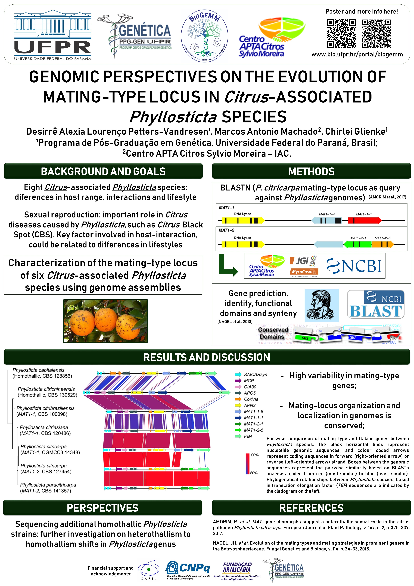

To this date, eight *Phyllosticta* species are known to be associated with *Citrus* hosts, presenting endophytic and pathogenic lifestyles. As sexual reproduction is a key factor involved in host-interaction, it could be related to the differences in lifestyles. To evaluate this hypothesis, we characterized the mating-type locus in six *Citrus*-associated *Phyllosticta* species from whole genome assemblies. Comparisons demonstrate that mating-type genes are highly variable in their sequence content, but the genomic location and organization of mating-type locus is conserved. *P. citriasiana*, *P. citribraziliensis* and *P. paracitricarpa* were described as heterothallic, and *P. citrichinaensis* was confirmed as homothallic. In addition, *P. citrichinaensis MAT1-2* idiomorph occurs in a separate location from the mating-type locus, something that was not described yet in *Phyllosticta* genus. Moreover, *P. capitalensis* and P. citrichinaensis homothallic strategies differ, which suggest they might result from independent evolutionary events. This study provides important information and perspectives for future studies on mating-type evolution in *Phyllosticta* genus, emphasizing the importance of studying *Citrus-Phyllosticta* interactions under genomic approaches.

