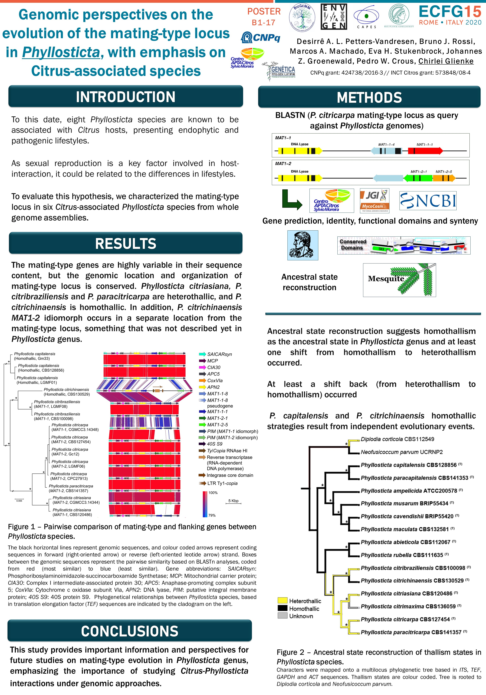

Sexual reproduction influences fungal evolution by increasing genetic variation and purging deleterious mutations, enabling species to deal with environmental challenges and genome instability. However, sexual reproduction is also costly, as it can break apart well-adapted genomic configurations. In this sense, the balance between inbreeding and outcrossing may differ between plant pathogens and endophytes and may require different reproduction strategies. The elucidation of reproduction mechanisms is  particularly important in pathogens, not only to understand how recombination may affect the structural and genetic integrity, but also because sexual structures may play a role in the interaction with the host. For example, *Phyllosticta citricarpa* causes Citrus Black Spot (CBS) disease and is heterothallic: its ascospores can infect fruits and leaves and play an important role in the cycle of CBS disease in populations where both *MAT1* idiomorphs are present. Seven additional species of *Phyllosticta* are known to be associated with citrus, presenting endophytic and pathogenic lifestyles, being host-specific or cosmopolitan species, with different reproduction strategies: *P. citriasiana*, *P. paracitricarpa* (pathogenic species) and *P. citribraziliensis* (endophyte) are heterothallic and host-specific, but *P. capitalensis* (endophytic in citrus and a cosmopolitan species), *P. paracapitalensis* (endophyte in citrus) and *P. citrichinaensis* (pathogen in citrus) are homothallic. Since sexual reproduction is involved in the *P. citricarpa*-citrus interaction, it may be related to the  differences in the lifestyles of *Phyllosticta*. To assess this hypothesis, our approach includes: (a) a detailed characterization of the mating-type locus and flanking genes in *Phyllosticta* species; and (b) a reconstruction of the ancestral character state to determine the ancestral thallism state for the genus *Phyllosticta*. We expect the organization and content of the mating-type region to be highly variable, in agreement to the very diverse lifestyles observed in *Phyllosticta* species.

