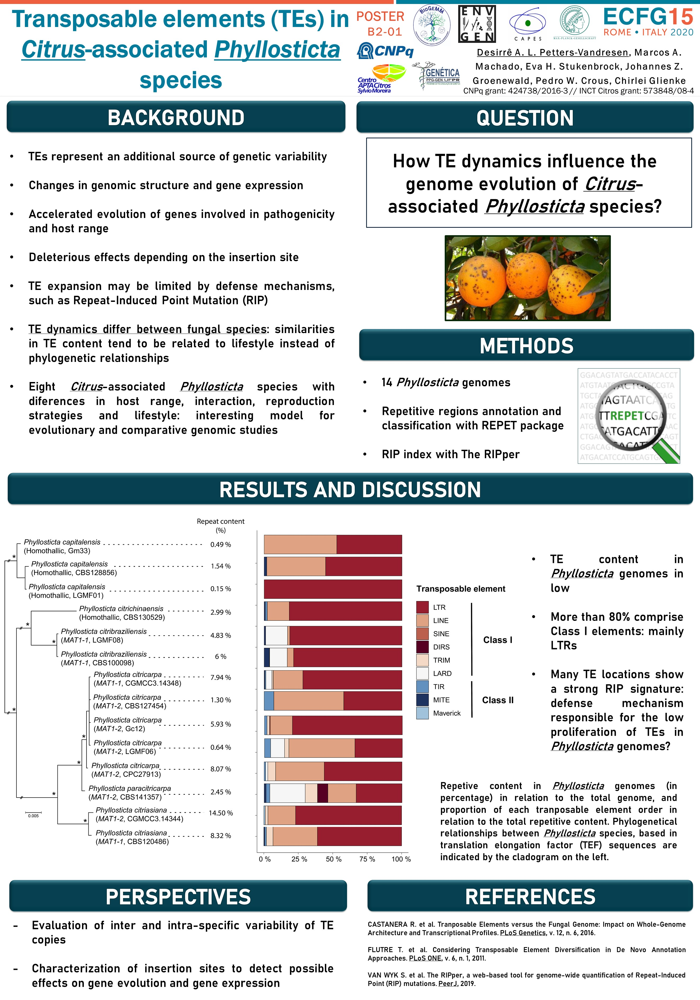

Transposable elements (TEs) are important for fungal genome evolution, leading to changes in genomic structure and gene expression. TEs represent an additional source of genetic variability other than recombination, being related to accelerated evolution of genes involved in pathogenicity and host range. However, depending on the insertion site, TE proliferation can lead to deleterious effects. Thus, TE expansion may be limited by defense mechanisms, such as Repeat-Induced Point Mutation (RIP). RIP detects DNA duplications and permanently inactivates them with C:G to T:A mutations. TE dynamics differ between fungal species, and similarities in TE content tend to be related to lifestyle instead of phylogenetic relationships. In this sense, our goal is to investigate how TE dynamics influence the genome evolution of *Citrus*-associated *Phyllosticta* species. These species present endophytic and pathogenic lifestyles, are host specific or cosmopolitan and employ different reproduction strategies. They represent an interesting model for evolutionary and comparative genomics studies, and we aim to investigate and understand the biological processes involved with their associations with citrus plants. Our results show that the TE content in *Phyllosticta* genomes is low, ranging from 0.5 – 1% in *P.  capitalensis*, 2% in *P. citribraziliensis*, 2.5% in *P. paracitricarpa*, 3% in *P. citrichinaensis*, 8% in *P. citriasiana* and from 1.3 to 8% in *P. citricarpa*. From these TEs, more than 80% are Class I elements, mainly LTRs, but LINEs, SINEs and DIRS were also observed. Moreover, many of these TE locations show a strong RIP signature, suggesting that this defense mechanism may be involved in the low proliferation of TEs at *Phyllosticta* genomes. Further steps of our study on TE dynamics in *Phyllosticta* include an evaluation of inter and intra-specific variabilities of TE copies and a characterization of the insertion sites, to detect possible effects in gene evolution and gene expression.

